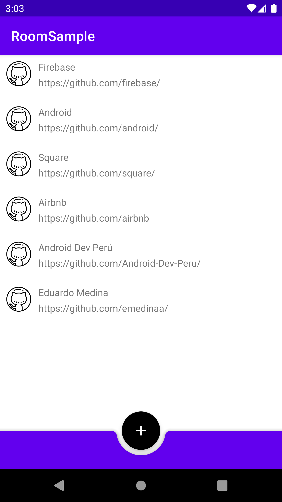

# kotlin-android-jetpack-room
[coming soon] Sample android application to demonstrate to use of Room Library.



# Upgrades

- Migration to Ksp [branch](https://github.com/emedinaa/kotlin-android-jetpack-room/tree/migration-to-ksp)
- Migration to Gradle version catalogs [branch](https://github.com/emedinaa/kotlin-android-jetpack-room/tree/migration-to-ksp)


kapt ->

```
BUILD SUCCESSFUL in 4-7 s
34 actionable tasks: 8 executed, 26 up-to-date
```

ksp ->

```
BUILD SUCCESSFUL in 3-6 s
33 actionable tasks: 7 executed, 26 up-to-date
```

Gradle version catalogs ->

```
gradle/libs.versions.toml
```
